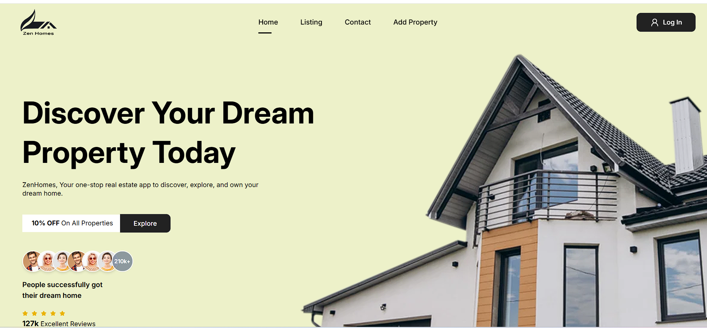

# ZenHomes – Real Estate Application



## 🌟 Overview

🚀 **ZenHomes** is a real estate application that enables users to browse, book, and manage properties seamlessly. The platform provides a user-friendly experience, allowing users to explore a variety of properties, book visits, and save their favorite listings, all in one place.

## 🌟 Features

- ✅ **User Authentication** – Secure login and registration
- ✅ **Property Browsing** – Browse a vast collection of properties available for booking
- ✅ **Booking Management** – Easily book, manage, and cancel property visits
- ✅ **Favorites** – Add properties to your favorites list for easy access and comparison
- ✅ **Add Property** – Users can add their own properties to the platform for others to explore
- ✅ **Dynamic Map Locations** – Interactive maps powered by **Mapbox** for property locations

## 🔗 Live Demo

Check out **ZenHomes** in action: **[Live Link](https://zenhomes-real-estate.vercel.app)** 🚀

## 💻 Tech Stack

| Category           | Technology                                             |
| ------------------ | ------------------------------------------------------ |
| **Frontend**       | React, Tailwind CSS, Mantine Core & Dates, React Query |
| **Backend**        | Node.js, Express.js, Prisma ORM                        |
| **Database**       | MongoDB                                                |
| **Authentication** | Auth0                                                  |
| **Image Storage**  | Cloudinary                                             |
| **Geolocation**    | Mapbox                                                 |
| **Deployment**     | Vercel                                                 |

## 📥 Installation

### Clone the repository:

```bash
git clone https://github.com/anjany06/zenHomes.git
cd zenHomes

```
